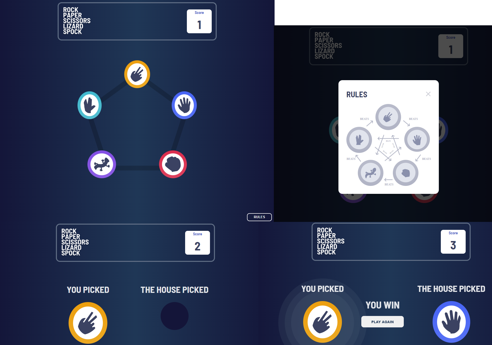
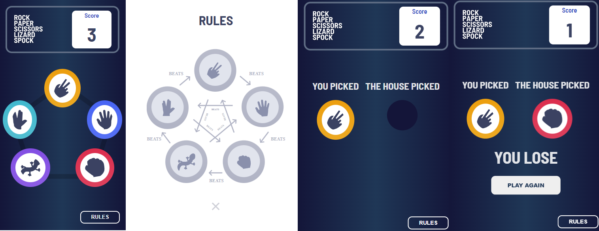

# Frontend Mentor - Rock, Paper, Scissors solution

This is a solution to the [Rock, Paper, Scissors challenge on Frontend Mentor](https://www.frontendmentor.io/challenges/rock-paper-scissors-game-pTgwgvgH). Frontend Mentor challenges help you improve your coding skills by building realistic projects.

## Table of contents

- [Overview](#overview)
  - [The challenge](#the-challenge)
  - [Screenshot](#screenshot)
  - [Links](#links)
- [My process](#my-process)
  - [Built with](#built-with)
  - [What I learned](#what-i-learned)
- [Author](#author)

## Overview

### The challenge

Users should be able to:

- View the optimal layout for the game depending on their device's screen size
- Play Rock, Paper, Scissors against the computer
- Maintain the state of the score after refreshing the browser _(optional)_
- **Bonus**: Play Rock, Paper, Scissors, Lizard, Spock against the computer _(optional)_

### Screenshot

Desktop:

Mobile:

### Links

- Solution URL: [https://github.com/Helbindi/rock-paper-scissor-game](https://github.com/Helbindi/rock-paper-scissor-game)
- Live Site URL: [https://helbindi-roshambo.vercel.app](https://github.com/Helbindi/rock-paper-scissor-game)

## My process

### Built with

- Semantic HTML5 markup
- CSS custom properties
- Flexbox
- CSS Grid
- Mobile-first workflow
- [React](https://reactjs.org/) - JS library

### What I learned

For this project, I learned to utilize the Reducer and Context hooks to manage the state of my game. Another part that was tricky for me was determining the best way to transition the Roshambo game logic into code.

## Author

- Website - [https://my-projects-site.vercel.app](https://my-projects-site.vercel.app)
- Frontend Mentor - [@Helbindi](https://www.frontendmentor.io/profile/Helbindi)
